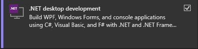

# Installation

WCSharp consists of a set of NuGet [packages](https://www.nuget.org/profiles/Orden).

## Requirements

WCSharp requires a C# development environment for .NET 6. If you're unfamiliar with the C# ecosystem we recommend installing [Visual Studio 2022](https://visualstudio.microsoft.com/vs/).

{ align=right style=margin-bottom:0; }

When installing Visual Studio, make sure to select the ".NET Desktop Development" workload.

If you've installed Visual Studio previously you can launch the [Visual Studio Installer](https://learn.microsoft.com/en-us/visualstudio/install/modify-visual-studio) and modify your installation instead.

!!! note
    WCSharp is built for .NET 6 and requires **Visual Studio 17.0 or higher**.

## WCSharp Template

The easiest way to install WCSharp is to [download the WCSharp template](https://github.com/Orden4/WCSharp/wiki/WCSharp-template). This is a scaffold project that sets you up with everything you need for C# mapmaking.

- A preconfigured Warcraft III map.
- A [Visual Studio solution](https://learn.microsoft.com/en-us/visualstudio/get-started/tutorial-projects-solutions) with a Launcher and a Source project.
- A .gitignore file for source control.

### Structure

```
WCSharpTemplate
├── Launcher                    --- Launcher Project (compiles the map)
│   ├── app.config
│   ├── Program.cs
│   └── Launcher.csproj
├── Source                      --- Source Project (where you write your C# map code)
│   ├── Constants.cs
│   ├── Program.cs
│   └── Source.csproj
├── artifacts                   --- Artifacts (the compilation output)
│   ├── war3map.lua
│   └── target.w3x
├── source.w3x                  --- Warcraft III Map (saved as folder)
│   └── [war3map files]
└── WCSharpTemplate.sln         --- Solution File
```

### Setup

Before launching the template, a few configuration seps are required.

1. Open `WCSharpTemplate.sln` with Visual Studio.
2. Right click the `Launcher` project and select `Set as Startup Project`.
3. Right click the `Launcher` project and click `Manage NuGet Packages`. Update all packages. Do the same for the `Source` project.
4. Set the path the Warcraft III executable path in `Launcher/app.config` is correct.
5. Move the included `Blizzard.j` and `common.j` files to `C:\Users\YourUserName\My Documents\Warcraft III\JassHelper`. Create the `JassHelper` folder if it doesn't exist.
6. Run the `Launcher` project in Visual Studio.
7. You will be provided with three options, select the third option to compile and run the map.